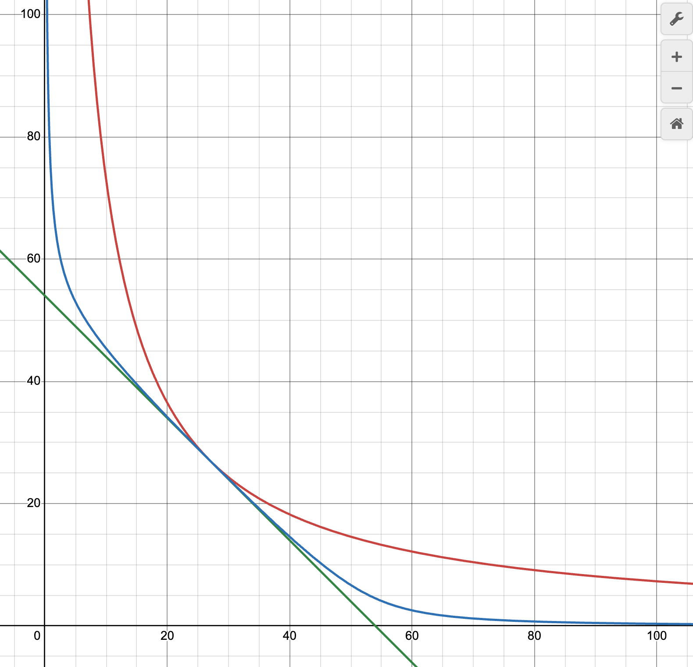

## Curve V1 Formula

1. **Pool With Two Tokens**

    <br>

    <br>

-   When the pool is balanced, the it behaves like a constant sum curve.
-   When the pool is imbalanced, the it behaves like a constant product curve.
-   When the A is increasing, the curve becomes flatter, and it behaves more like a constant sum, when A is 0, the curve becomes a constant product curve.

2. **Pool With N Tokens**

    **Constant Sum**:

    $\large \sum_{i=1}^N x_i = D$

     <br>

    **Constant Product**:

    $\large \prod_{i=1}^N x_i = (\frac{D}{N})^N$

     <br>

    **Formula**:

    $\large KD^{N-1}\sum_{i=1}^N x_i + \prod_{i=1}^N x_i = KD^N + (\frac{D}{N})^N$

    $\Large K=A\frac{\prod_{i=1}^N x_i}{(\frac{D}{N})^N}$

     <br>

    **Alternative Formula**:

    $\large AN^N\sum_{i=1}^N x_i + D = ADN^N+\frac{D^{N+1}}{N^N\prod_{i=1}^N x_i}$

     <br>

    We can derive the alternative formula by multiply the both sides of the original formula by $D$ then divide by $\prod_{i=1}^N x_i$

     <br>

    $\large \frac{D}{\prod_{i=1}^N x_i}(A\frac{\prod_{i=1}^N x_i}{(\frac{D}{N})^N}D^{N-1}\sum_{i=1}^N x_i + \prod_{i=1}^N x_i) = \frac{D}{\prod_{i=1}^N x_i}(A\frac{\prod_{i=1}^N x_i}{(\frac{D}{N})^N}D^N + (\frac{D}{N})^N)$

     <br>

## Newton's Method

<br>

## Imbalance fee

when user adds liquidity that cause the pool to be imbalanced, an imbalance fee will be applied to all tokens.

For example:

1. At time $t_0$, there are 100 DAI, 90 USDC, and 100 USDT in the pool.
   For the pool to be perfectly balanced, the amount of DAI, USDC, and USDT should all be 100, so $\large \frac{D_0}{3} \approx 100$

<br>

2. At time $t_1$, user adds 300 DAI, 0 USDC, and 0 USDT to the pool.
   For the pool to be perfectly balanced, the amount of DAI, USDC, and USDT should all be roughly 194, so $\large \frac{D_1}{3} \approx 194$

<br>

Then we calculate the multiplier of how much liquidity in percentage is added to the pool.

$\large \frac{D_1}{D_0} \approx \frac{581}{300} \approx 1.94$

This mean that in a perfectly balanced pool, each token should be 94% more than the original amount.

If we increase all of the token by 94%, in theory, DAI will be 194, USDC will be 174, and USDT will be 213. Then we take the difference between the actual balance after the increase and the theoretical balance. We can calculate the imbalance amount that will be charged an imbalance fee.

DAI: $|400 - 194| = 206$

USDC: $|90 - 174| = 84$

USDT: $|110 - 213| = 103$

<br>

Then will multiply the imbalance amount by the fee multiplier. If the fee multiplier is 0.01, then the imbalance fee will be:

DAI: $206 \times 0.01 = 2.06$

USDC: $84 \times 0.01 = 0.84$

USDT: $103 \times 0.01 = 1.03$

Those imbalance fee amounts will be deducted from the pool's token balances. Then this will be the final token balances of the pool.

<br>

Formula:

```python
_fee: uint256 = self.fee * N_COINS / (4 * (N_COINS - 1))
```

Reference:
https://ethereum.stackexchange.com/questions/124850/curve-amm-how-is-fee-calculated-when-adding-liquidity
