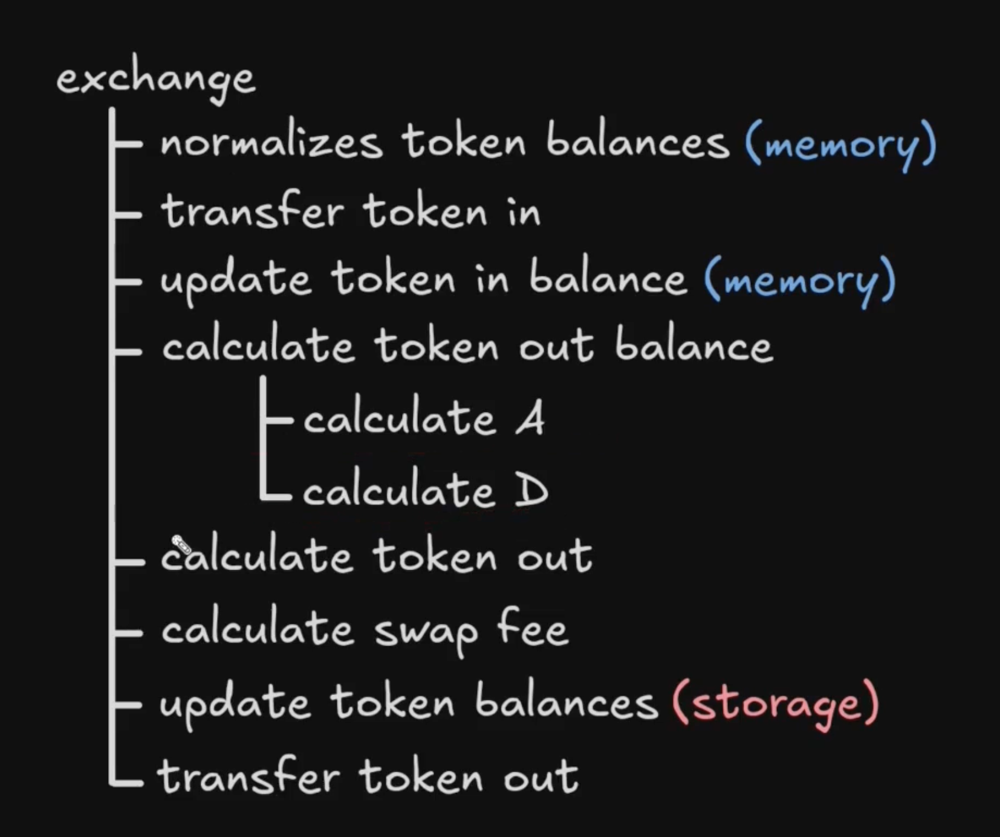
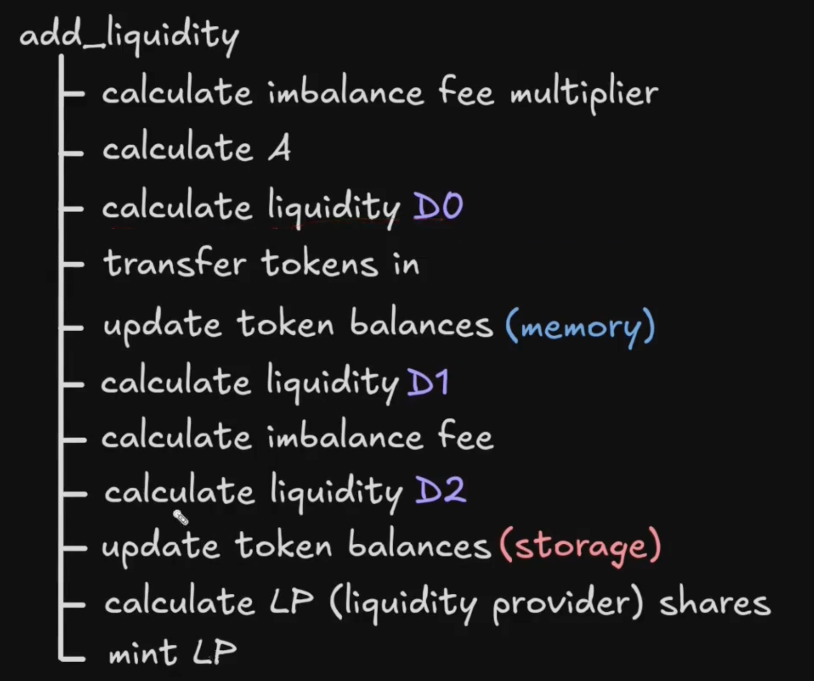
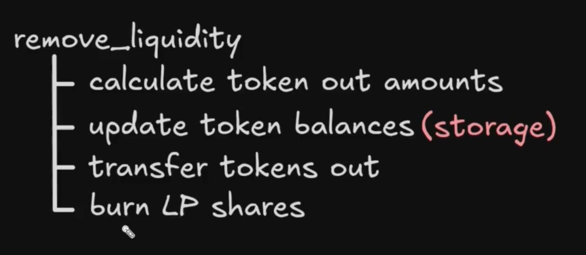

## Curve V1 Contract

Most of the contracts are variants of the following contract.

https://github.com/curvefi/curve-contract/blob/master/contracts/pools/3pool/StableSwap3Pool.vy

## Execution steps

**exchange function:**

<br>

**add_liquidity function:**

<br>

**remove_liquidity function:**

<br>

## Normalize token amount based on decimals

All token amounts are normalized based on 18 decimals.

```python
@pure
@internal
def _xp_mem(_balances: uint256[N_COINS]) -> uint256[N_COINS]:
    # result = [1e18, 1e30, 1e30]
    result: uint256[N_COINS] = RATES
    # DAI = 1e18 * DAI_balance / 1e18
    # USDC = 1e30 * USDC_balance / 1e18
    # USDT = 1e30 * USDT_balance / 1e18
    for i in range(N_COINS):
        result[i] = result[i] * _balances[i] / PRECISION
    return result
```

## Update and calculate A

A can only be set by the admin of the pool.

```python
@external
def ramp_A(_future_A: uint256, _future_time: uint256):
    assert msg.sender == self.owner  # dev: only owner
    assert block.timestamp >= self.initial_A_time + MIN_RAMP_TIME
    assert _future_time >= block.timestamp + MIN_RAMP_TIME  # dev: insufficient time

    _initial_A: uint256 = self._A()
    assert (_future_A > 0) and (_future_A < MAX_A)
    assert ((_future_A >= _initial_A) and (_future_A <= _initial_A * MAX_A_CHANGE)) or\
           ((_future_A < _initial_A) and (_future_A * MAX_A_CHANGE >= _initial_A))
    self.initial_A = _initial_A
    self.future_A = _future_A
    self.initial_A_time = block.timestamp
    self.future_A_time = _future_time

    log RampA(_initial_A, _future_A, block.timestamp, _future_time)


@external
def stop_ramp_A():
    assert msg.sender == self.owner  # dev: only owner

    current_A: uint256 = self._A()
    self.initial_A = current_A
    self.future_A = current_A
    self.initial_A_time = block.timestamp
    self.future_A_time = block.timestamp
    # now (block.timestamp < t1) is always False, so we return saved A

    log StopRampA(current_A, block.timestamp)
```

If the current A is different from target A, it will gradually move towards the target A at a rate proportional to the time difference between the current time and the target time.

```python
@view
@internal
def _A() -> uint256:
"""
Handle ramping A up or down
"""
t1: uint256 = self.future_A_time
A1: uint256 = self.future_A

if block.timestamp < t1:
    A0: uint256 = self.initial_A
    t0: uint256 = self.initial_A_time
    # Expressions in uint256 cannot have negative numbers, thus "if"
    if A1 > A0:
        return A0 + (A1 - A0) * (block.timestamp - t0) / (t1 - t0)
    else:
        return A0 - (A0 - A1) * (block.timestamp - t0) / (t1 - t0)

else:  # when t1 == 0 or block.timestamp >= t1
    return A1

```

## Calculate D

D is total liquidity of the pool. It represents the sum of all normalized token balances. In a perfectly balanced stable swap pool, the normalized token balance of each token is: $\frac{D}{N\_COINS}$.

```python
@pure
@internal
def get_D(xp: uint256[N_COINS], amp: uint256) -> uint256:
    S: uint256 = 0
    for _x in xp:
        S += _x
    if S == 0:
        return 0

    Dprev: uint256 = 0
    D: uint256 = S
    Ann: uint256 = amp * N_COINS
    for _i in range(255):
        D_P: uint256 = D
        for _x in xp:
            D_P = D_P * D / (_x * N_COINS)  # If division by 0, this will be borked: only withdrawal will work. And that is good
        Dprev = D
        D = (Ann * S + D_P * N_COINS) * D / ((Ann - 1) * D + (N_COINS + 1) * D_P)
        # Equality with the precision of 1
        if D > Dprev:
            if D - Dprev <= 1:
                break
        else:
            if Dprev - D <= 1:
                break
    return D
```

## Get Virtual Price

calculates the value of each LP token

```python
@view
@external
def get_virtual_price() -> uint256:
    """
    Returns portfolio virtual price (for calculating profit)
    scaled up by 1e18
    """
    D: uint256 = self.get_D(self._xp(), self._A())
    # D is in the units similar to DAI (e.g. converted to precision 1e18)
    # When balanced, D = n * x_u - total virtual value of the portfolio
    token_supply: uint256 = self.token.totalSupply()
    return D * PRECISION / token_supply
```

## Calculate LP token amount

calculate the amount of LP tokens that would be minted or burned when adding or removing liquidity

```python
@view
@external
def calc_token_amount(amounts: uint256[N_COINS], deposit: bool) -> uint256:
    """
    Simplified method to calculate addition or reduction in token supply at
    deposit or withdrawal without taking fees into account (but looking at
    slippage).
    Needed to prevent front-running, not for precise calculations!
    """
    _balances: uint256[N_COINS] = self.balances
    amp: uint256 = self._A()
    D0: uint256 = self.get_D_mem(_balances, amp)
    for i in range(N_COINS):
        if deposit:
            _balances[i] += amounts[i]
        else:
            _balances[i] -= amounts[i]
    D1: uint256 = self.get_D_mem(_balances, amp)
    token_amount: uint256 = self.token.totalSupply()
    diff: uint256 = 0
    if deposit:
        diff = D1 - D0
    else:
        diff = D0 - D1
    return diff * token_amount / D0
```
