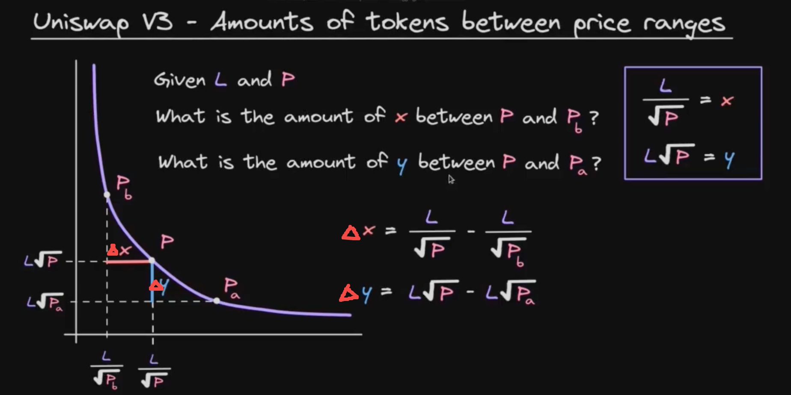
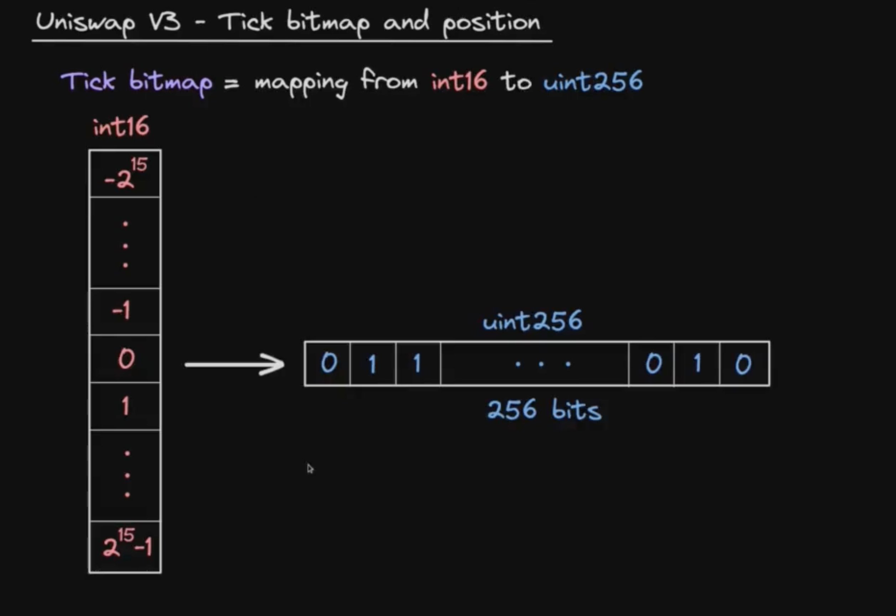
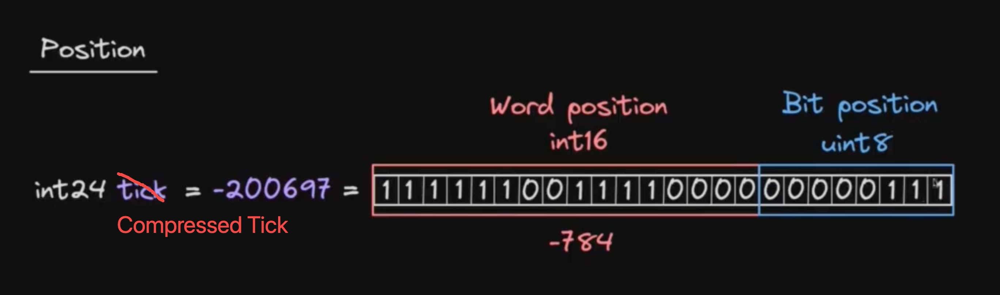

## Spot price

$P = 1.0001^{tick}$

$SqrtPriceX96 = \sqrt{P} * Q96$

($Q96 = 2^{96}$ `FixedPoint96.sol`)

Normalized $\Large P = P * (\frac{10^{token0Decimals}}{10^{token1Decimals}})$

## Equations for X and Y

$X = X_{real} + X_{virtual}$

$Y = Y_{real} + Y_{virtual}$

$XY = L^2$

$P = \frac{Y}{X}$

$X = \Large \frac{L}{\sqrt{P}}$

$Y = L\sqrt{P} $

## Curve of the real reserves

**Formula**:

$\Large (X_{real}+\frac{L}{\sqrt{P_{b}}})(Y_{real}+ L\sqrt{P_{a}}) = L^2$

**How to derive the equation for virtual reserves?**

1. when the current tick is at lower bound, the price is $\frac{Y}{X} = P_{a}$ , all real reserves are in token0 (aka X token)

    $X * Y_{virtual} = L^2$

    $\large Y_{virtual} = \frac{L^2}{X} = \frac{L^2}{\frac{L}{\sqrt{P_{a}}}} = L\sqrt{P_{a}}$

2. when the current tick is at upper bound, the price is $\frac{Y}{X} = P_{b}$ , all real reserves are in token1 (aka Y token)

    $Y * X_{virtual} = L^2$

    $\large X_{virtual} = \frac{L^2}{Y} = \frac{L^2}{L\sqrt{P_{b}}} = \frac{L}{\sqrt{P_{b}}}$

## Calculate amount out within one range

<br>

**Generalized formula**:

$\large \Delta X = \frac{L}{\sqrt{P_{lower}}} - \frac{L}{\sqrt{P_{upper}}} = \large \frac{L(\sqrt{P_{upper}} - \sqrt{P_{lower}})}{\sqrt{P_{lower}} \sqrt{P_{upper}}}$

reference: `SqrtPriceMath.sol::getAmount0Delta`

$\large \Delta Y = L\sqrt{P_{upper}} - L\sqrt{P_{lower}} = L(\sqrt{P_{upper}} - \sqrt{P_{lower}})$

reference: `SqrtPriceMath.sol::getAmount1Delta`

## Swap Steps

-   main inputs:

    -   zeroForOne: true if token0 -> token1, false if token1 -> token0
    -   amountSpecified: exact in if > 0, exact out if < 0
    -   sqrtPriceLimitX96: the price limit for the swap

-   while loop
    -   while amountSpecified != 0 and state.sqrtPriceX96 != sqrtPriceLimitX96
    -   use `tickBitmap.sol::nextInitializedTickWithinOneWord` to the next tick boundry
    -   use `SwapMath.sol::ComputeSwapStep` to calculate the amount out , amount inand fee
-   update liquidity, sqrtPriceX96, tick and fee growth
-   send token out
-   swap call back (msg.sender sends token in)
-   check token balances

## Get Next Sqrt Prcice From Input

$\large \Delta X = \frac{L}{\sqrt{P_{lower}}} - \frac{L}{\sqrt{P_{upper}}} = \large \frac{L(\sqrt{P_{upper}} - \sqrt{P_{lower}})}{\sqrt{P_{lower}} \sqrt{P_{upper}}}$

$\Delta X * \sqrt{P_{lower}} \sqrt{P_{upper}} = L\sqrt{P_{upper}} - L\sqrt{P_{lower}}$

$L\sqrt{P_{lower}} = (\frac{L\sqrt{P_{upper}}}{L + \Delta X * \sqrt{P_{lower}}})$

reference: `SqrtPriceMath.sol::getNextSqrtPriceFromAmount0RoundingUp`

## Tick Bitmap

<br>

`int24 compressed = tick / tickSpacing;`

Compressed tick is int24 which is broken down into word position (int16) and bit position (uint8)

<br>

### Flip tick

```javascript
function flipTick(
    mapping(int16 => uint256) storage self,
    int24 tick,
    int24 tickSpacing
) internal {
    require(tick % tickSpacing == 0); // ensure that the tick is spaced
    (int16 wordPos, uint8 bitPos) = position(tick / tickSpacing);
    uint256 mask = 1 << bitPos;
    self[wordPos] ^= mask;
}
```

1. `mask = 1 << bitPos` creates a value with a single 1 bit at position bitPos
2. `self[wordPos] ^= mask` flips the bit at the specified position

Bitwise XOR Behavior

-   If the bits are the same (both 0 or both 1), the result is 0
-   If the bits are different (one is 0 and one is 1), the result is 1

### Next initialized tick within one word

```javascript
/// @notice Returns the next initialized tick contained in the same word (or adjacent word) as the tick that is either
/// to the left (less than or equal to) or right (greater than) of the given tick
/// @param self The mapping in which to compute the next initialized tick
/// @param tick The starting tick
/// @param tickSpacing The spacing between usable ticks
/// @param lte Whether to search for the next initialized tick to the left (less than or equal to the starting tick)
/// @return next The next initialized or uninitialized tick up to 256 ticks away from the current tick
/// @return initialized Whether the next tick is initialized, as the function only searches within up to 256 ticks
function nextInitializedTickWithinOneWord(
    mapping(int16 => uint256) storage self,
    int24 tick,
    int24 tickSpacing,
    bool lte
) internal view returns (int24 next, bool initialized) {
    int24 compressed = tick / tickSpacing;
    if (tick < 0 && tick % tickSpacing != 0) compressed--; // round towards negative infinity

    if (lte) {
        (int16 wordPos, uint8 bitPos) = position(compressed);
        // all the 1s at or to the right of the current bitPos
        uint256 mask = (1 << bitPos) - 1 + (1 << bitPos);
        uint256 masked = self[wordPos] & mask;

        // if there are no initialized ticks to the right of or at the current tick, return rightmost in the word
        initialized = masked != 0;
        // overflow/underflow is possible, but prevented externally by limiting both tickSpacing and tick
        next = initialized
            ? (compressed - int24(bitPos - BitMath.mostSignificantBit(masked))) * tickSpacing
            : (compressed - int24(bitPos)) * tickSpacing;
    } else {
        // start from the word of the next tick, since the current tick state doesn't matter
        (int16 wordPos, uint8 bitPos) = position(compressed + 1);
        // all the 1s at or to the left of the bitPos
        uint256 mask = ~((1 << bitPos) - 1);
        uint256 masked = self[wordPos] & mask;

        // if there are no initialized ticks to the left of the current tick, return leftmost in the word
        initialized = masked != 0;
        // overflow/underflow is possible, but prevented externally by limiting both tickSpacing and tick
        next = initialized
            ? (compressed + 1 + int24(BitMath.leastSignificantBit(masked) - bitPos)) * tickSpacing
            : (compressed + 1 + int24(type(uint8).max - bitPos)) * tickSpacing;
    }
}
```
