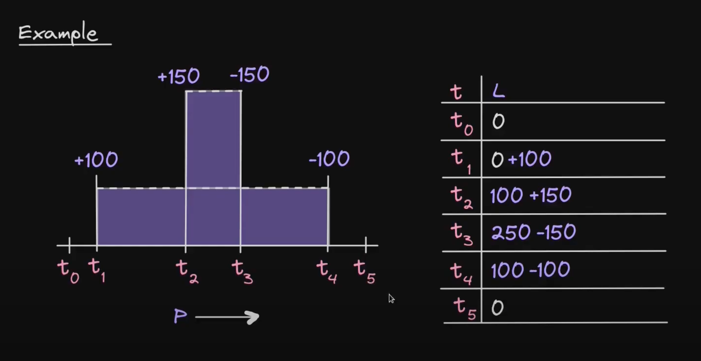

## How does Uniswap V3 Pool contract record user's position?

In the Uniswap V3 Pool contract, user's position is recorded in the `positions` mapping.

```solidity
mapping(bytes32 => Position.Info) public override positions;
```

The key is the hash of the owner's address, the lower tick boundary, and the upper tick boundary.

```javascript
keccak256(abi.encodePacked(owner, tickLower, tickUpper));
```

However, in most cases, the liquidity was added by the NonfungiblePositionManager contract. In that case, the owner is always the NonfungiblePositionManager contract, and the tickLower and tickUpper are the tick boundaries of the position.

And each user's position is recorded in the NonfungiblePositionManager contract where the key is the NFT token ID.

```javascript
/// @dev The token ID position data
mapping(uint256 => Position) private _positions;
```

## How does liquidity being added to the tick boundary?

When liquidity is added to a price range, the net liquidity is being added to the lower tick and being subtracted from the upper tick.



## How does current liquidity being changed when crossing the tick boundary?

When price crosses tick boundary from left to right (aka increasing), the net liquidity at that tick boundary is being added to the current liquidity.

When price crosses tick boundary from right to left (aka decreasing), the net liquidity at that tick boundary is being subtracted from the current liquidity.
