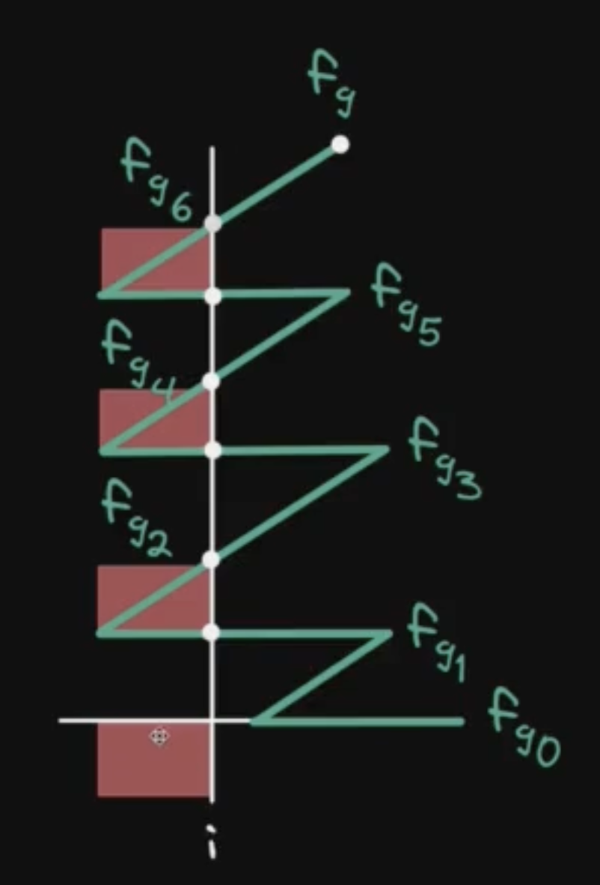
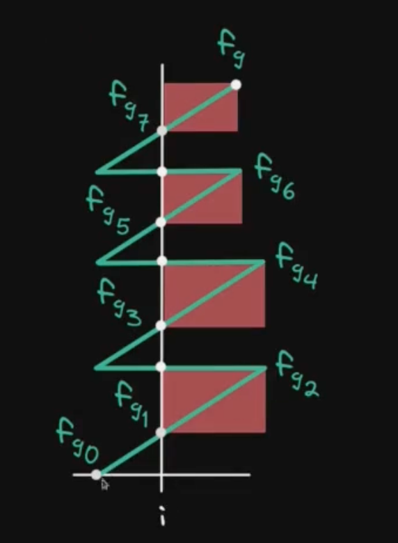

## How does fee growth outside being calculated?

$f_g = \text{Fee growth}$

$f_o,_i = \text{Fee growth outside at tick i}$

### Algorithm:

1. Initialize:

```math
\begin{aligned}
f_o,_i &= f_g \text{ (if tick i <= current tick)} \\
f_o,_i &= 0 \text{ { (otherwise)}}
\end{aligned}
```

2. Update:

```math
f_o,_i = f_g - f_o,_i \text{ (when price crosses tick i)}
```

## Fee growth below



| t                  | $f_b$                                                          | $f_o,_i$                                                       | $f_b$            |
| ------------------ | -------------------------------------------------------------- | -------------------------------------------------------------- | ---------------- |
| $t_0$ <= t < $t_1$ | $f_{g0}$                                                       | $f_{g0}$                                                       | $f_o,_i$         |
| $t_1$ <= t < $t_2$ | $f_g - f_{g1} + f_{g0}$                                        | $f_{g1} - f_{g0}$                                              | $f_{g} - f_o,_i$ |
| $t_2$ <= t < $t_3$ | $f_{g2} - f_{g1} + f_{g0}$                                     | $f_{g2} - f_{g1} + f_{g0}$                                     | $f_o,_i$         |
| $t_3$ <= t < $t_4$ | $f_{g} - f_{g3} + f_{g2} - f_{g1} + f_{g0}$                    | $f_{g3} - f_{g2} + f_{g1} - f_{g0}$                            | $f_{g} - f_o,_i$ |
| $t_4$ <= t < $t_5$ | $f_{g4} - f_{g3} + f_{g2} - f_{g1} + f_{g0}$                   | $f_{g4} - f_{g3} + f_{g2} - f_{g1} + f_{g0}$                   | $f_o,_i$         |
| $t_5$ <= t < $t_6$ | $f_g - f_{g5} + f_{g4} - f_{g3} + f_{g2} - f_{g1} + f_{g0}$    | $f_{g5} - f_{g4} + f_{g3} - f_{g2} + f_{g1} - f_{g0}$          | $f_{g} - f_o,_i$ |
| $t_6$ <= t < $t_c$ | $f_{g6} - f_{g5} + f_{g4} - f_{g3} + f_{g2} - f_{g1} + f_{g0}$ | $f_{g6} - f_{g5} + f_{g4} - f_{g3} + f_{g2} - f_{g1} + f_{g0}$ | $f_o,_i$         |

---

**Equation for $f_b$ in terms of $f_g$ and $f_o,_i$ :**

$i_c = \text{current tick}$

```math
\begin{aligned}
f_b &= f_o,_i \text{ (if } i \text{ <= } i_c \text{)} \\
f_b &= f_g - f_o,_i \text{ (if } i_c \text{ < } i \text{)} \\
\end{aligned}
```

## Fee growth above



| t                  | $f_a$                                                 | $f_o,_i$                                              | $f_a$            |
| ------------------ | ----------------------------------------------------- | ----------------------------------------------------- | ---------------- |
| $t_0$ <= t < $t_1$ | $0$                                                   | $0$                                                   | $f_o,_i$         |
| $t_1$ <= t < $t_2$ | $f_g - f_{g1}$                                        | $f_{g1}$                                              | $f_{g} - f_o,_i$ |
| $t_2$ <= t < $t_3$ | $f_{g2} - f_{g1}$                                     | $f_{g2} - f_{g1}$                                     | $f_o,_i$         |
| $t_3$ <= t < $t_4$ | $f_g - f_{g3} + f_{g2} - f_{g1}$                      | $f_{g3} - f_{g2} + f_{g1}$                            | $f_{g} - f_o,_i$ |
| $t_4$ <= t < $t_5$ | $f_{g4} - f_{g3} + f_{g2} - f_{g1}$                   | $f_{g4} - f_{g3} + f_{g2} - f_{g1}$                   | $f_o,_i$         |
| $t_5$ <= t < $t_6$ | $f_g - f_{g5} + f_{g4} - f_{g3} + f_{g2} - f_{g1}$    | $f_{g5} - f_{g4} + f_{g3} - f_{g2} + f_{g1}$          | $f_{g} - f_o,_i$ |
| $t_6$ <= t < $t_c$ | $f_{g6} - f_{g5} + f_{g4} - f_{g3} + f_{g2} - f_{g1}$ | $f_{g6} - f_{g5} + f_{g4} - f_{g3} + f_{g2} - f_{g1}$ | $f_o,_i$         |

---

**Equation for $f_a$ in terms of $f_g$ and $f_o,_i$ :**

$i_c = \text{current tick}$

```math
\begin{aligned}
f_a &= f_g - f_o,_i \text{ (if } i \text{ <= } i_c \text{)} \\
f_a &= f_o,_i \text{ (if } i_c \text{ < } i \text{)} \\
\end{aligned}
```
